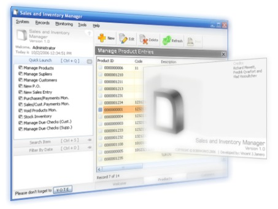



## bob8works\(Vincent J\. Jamero\): SIM \- Sales and Inventory Manager

### Description

A simple application that can support purchasing, sales and automated inventory management. I earned a lot from PSCODE.com that is why I want to share this piece of code to all beginners and for those who want to learn VB6. It includes 16 user controls and a modified LynxGrid control which originally created by Richard Mewett. E-mail me at bob8works@yahoo.com if you need have questions or inquiries. Thanks!
 
### More Info
 

             |
---                |---
**Submitted On**   |2006-10-02 12:29:38
**By**             |[bob8works](https://github.com/Planet-Source-Code/PSCIndex/blob/master/ByAuthor/bob8works.md)
**Level**          |Intermediate
**User Rating**    |4.9 (690 globes from 142 users)
**Compatibility**  |VB 5\.0, VB 6\.0, VBA MS Access
**Category**       |[Complete Applications](https://github.com/Planet-Source-Code/PSCIndex/blob/master/ByCategory/complete-applications__1-27.md)
**World**          |[Visual Basic](https://github.com/Planet-Source-Code/PSCIndex/blob/master/ByWorld/visual-basic.md)
**Archive File**   |[bob8works\(2149734152009\.zip](https://github.com/Planet-Source-Code/bob8works-bob8works-vincent-j-jamero-sim-sales-and-inventory-manager__1-66681/archive/master.zip)

